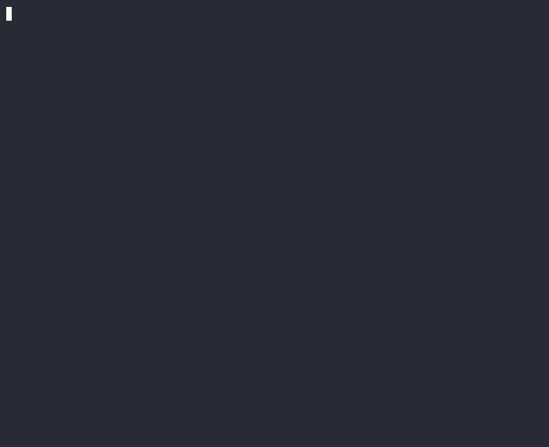

<h1 align="center">InkUI</h1>

<p align="center">
  <strong>shadcn/ui for the terminal.</strong><br/>
  Copy-paste components for <a href="https://github.com/vadimdemedes/ink">Ink</a> — the React renderer for CLIs.
</p>

<p align="center">
  <a href="https://inkui-lib.vercel.app">inkui-lib.vercel.app</a> ·
  <a href="https://inkui-lib.vercel.app/docs/getting-started/introduction">Docs</a> ·
  <a href="https://inkui-lib.vercel.app/docs/components/spinner">Components</a>
</p>

<p align="center">
  <a href="https://github.com/kamlesh723/InkUI/actions/workflows/ci.yml">
    
  </a>
  <a href="https://www.npmjs.com/package/@inkui-cli/cli">
    
  </a>
  <a href="https://www.npmjs.com/package/@inkui-cli/core">
    
  </a>
  
  
  <a href="LICENSE">
    
  </a>
</p>

<br/>



<br/>

---

## The idea

Every time you build a CLI in Ink you rewrite the same spinner, progress bar, and select menu. InkUI gives you a starting point — but instead of shipping a black-box library, it works like **[shadcn/ui](https://ui.shadcn.com/)**: you run one command and get the TypeScript source file in your own project.

```bash
npx inkui add spinner
```

```
./components/ui/spinner/
  ├── Spinner.tsx   ← your file now
  └── index.ts
```

```tsx
import { Spinner } from './components/ui/spinner';

<Spinner label="Deploying to production..." type="arc" />
```

That's it. No new `node_modules` entry. No version drift. No surprise breaking changes. **Just code you own and can change.**

---

## Quick start

```bash
# See all available components
npx inkui list

# Add one component
npx inkui add spinner

# Add several at once
npx inkui add badge progress-bar table

# Add everything
npx inkui add --all
```

Your project only needs two peer deps:

```bash
npm install ink react
```

---

## What you can build

See [inkui-lib.vercel.app](https://inkui-lib.vercel.app) for live animated demos of real CLIs built with InkUI — **DeployKit**, **AuditShield**, and **DevDash** — each assembled from InkUI components with side-by-side terminal previews and one-line install commands.

---

## Components

| Component | What it does | Install |
|---|---|---|
| **Spinner** | Animated spinner — `dots` `line` `arc` `bounce` | `npx inkui add spinner` |
| **Badge** | Status chip — `default` `success` `warning` `error` `info` | `npx inkui add badge` |
| **ProgressBar** | Fill bar with `%`, auto-sizes to terminal width | `npx inkui add progress-bar` |
| **TextInput** | Cursor, arrows, backspace, placeholder, password mask | `npx inkui add text-input` |
| **Select** | Arrow-key single-select, skips disabled items, generic `Select<T>` | `npx inkui add select` |
| **MultiSelect** | Space-to-toggle checkboxes, pre-selection, generic `MultiSelect<T>` | `npx inkui add multi-select` |
| **Table** | Auto column widths, overflow truncation, 5 border styles | `npx inkui add table` |
| **Dialog** | Modal — title, message, keyboard-navigable action buttons | `npx inkui add dialog` |
| **Toast** | Auto-dismissing notifications — `success` `warning` `error` `info` | `npx inkui add toast` |
| **StatusIndicator** | Animated dot + label for service/connection health | `npx inkui add status-indicator` |
| **LoadingBar** | Slim bar — indeterminate bounce or determinate `value` | `npx inkui add loading-bar` |
| **Confirm** | `y/N` prompt with default, resolves to static confirmation line | `npx inkui add confirm` |
| **KeyHint** | Row of `[key] label` keyboard shortcut hints | `npx inkui add key-hint` |
| **Divider** | Full-width separator — `single` `double` `dashed` `bold`, optional title | `npx inkui add divider` |
| **Header** | App header bar — `box` `line` `filled` styles, title + subtitle | `npx inkui add header` |

---

## API reference

### Spinner

```tsx
import { Spinner } from './components/ui/spinner';

<Spinner label="Resolving packages..." />
<Spinner type="arc"    label="Uploading..."  />
<Spinner type="line"   label="Building..."   interval={40} />
<Spinner type="bounce" label="Connecting..." />
```

| Prop | Type | Default | Description |
|---|---|---|---|
| `label` | `string` | `''` | Text shown after the frame |
| `type` | `'dots' \| 'line' \| 'arc' \| 'bounce'` | `'dots'` | Animation style |
| `interval` | `number` | `80` | Frame speed in ms |
| `theme` | `InkUITheme` | `darkTheme` | Color theme |

---

### Badge

```tsx
import { Badge } from './components/ui/badge';

<Badge variant="success">deployed</Badge>
<Badge variant="warning">degraded</Badge>
<Badge variant="error">failed</Badge>
<Badge variant="info">queued</Badge>
<Badge variant="default">v0.1.0</Badge>
```

| Prop | Type | Default | Description |
|---|---|---|---|
| `children` | `string` | *required* | Label text |
| `variant` | `'default' \| 'success' \| 'warning' \| 'error' \| 'info'` | `'default'` | Color style |
| `theme` | `InkUITheme` | `darkTheme` | Color theme |

---

### ProgressBar

```tsx
import { ProgressBar } from './components/ui/progress-bar';

const [progress, setProgress] = useState(0);

<ProgressBar value={progress} label="Downloading" />
<ProgressBar value={66} width={40} showPercent={false} />
```

| Prop | Type | Default | Description |
|---|---|---|---|
| `value` | `number` | *required* | 0–100 |
| `label` | `string` | — | Left-side label |
| `showPercent` | `boolean` | `true` | Show `%` on the right |
| `width` | `number` | auto | Fixed bar width in columns |
| `theme` | `InkUITheme` | `darkTheme` | Color theme |

---

### TextInput

```tsx
import { TextInput } from './components/ui/text-input';

const [name, setName] = useState('');

<TextInput
  label="Name"
  value={name}
  onChange={setName}
  onSubmit={(v) => console.log('submitted:', v)}
  placeholder="Enter your name"
/>

// Password — masks as *
<TextInput value={pass} onChange={setPass} password label="Token" />
```

| Prop | Type | Default | Description |
|---|---|---|---|
| `value` | `string` | *required* | Controlled value |
| `onChange` | `(v: string) => void` | *required* | Called on every keystroke |
| `onSubmit` | `(v: string) => void` | — | Called on Enter |
| `placeholder` | `string` | `''` | Shown when empty |
| `password` | `boolean` | `false` | Mask input as `*` |
| `focus` | `boolean` | `true` | Whether this field is active |
| `label` | `string` | — | Left-side label |
| `theme` | `InkUITheme` | `darkTheme` | Color theme |

---

### Select

```tsx
import { Select } from './components/ui/select';
import type { SelectItem } from './components/ui/select';

type Framework = 'react' | 'vue' | 'svelte';

const items: SelectItem<Framework>[] = [
  { label: 'React',   value: 'react' },
  { label: 'Vue',     value: 'vue' },
  { label: 'Svelte',  value: 'svelte' },
  { label: 'Angular', value: 'angular' as any, disabled: true },
];

<Select items={items} onSelect={(item) => console.log(item.value)} />
```

Keys: `↑ ↓` navigate · `Enter` confirm · disabled items are skipped automatically.

| Prop | Type | Default | Description |
|---|---|---|---|
| `items` | `SelectItem<T>[]` | *required* | Option list |
| `onSelect` | `(item: SelectItem<T>) => void` | *required* | Called on confirm |
| `focus` | `boolean` | `true` | Whether this component is active |
| `theme` | `InkUITheme` | `darkTheme` | Color theme |

---

### MultiSelect

```tsx
import { MultiSelect } from './components/ui/multi-select';

<MultiSelect
  items={[
    { label: 'TypeScript', value: 'ts' },
    { label: 'ESLint',     value: 'eslint' },
    { label: 'Prettier',   value: 'prettier' },
    { label: 'Husky',      value: 'husky', disabled: true },
  ]}
  defaultSelected={['ts', 'eslint']}
  onSubmit={(selected) => console.log(selected.map((s) => s.value))}
/>
```

Keys: `↑ ↓` navigate · `Space` toggle `◯/◉` · `Enter` confirm.

| Prop | Type | Default | Description |
|---|---|---|---|
| `items` | `MultiSelectItem<T>[]` | *required* | Option list |
| `onSubmit` | `(selected: MultiSelectItem<T>[]) => void` | *required* | Called on confirm |
| `defaultSelected` | `T[]` | `[]` | Pre-selected values |
| `focus` | `boolean` | `true` | Whether this component is active |
| `theme` | `InkUITheme` | `darkTheme` | Color theme |

---

### Table

```tsx
import { Table } from './components/ui/table';
import type { TableColumn } from './components/ui/table';

type Package = { name: string; version: string; size: string };

const columns: TableColumn<Package>[] = [
  { key: 'name',    header: 'Package', align: 'left'   },
  { key: 'version', header: 'Version', align: 'center' },
  { key: 'size',    header: 'Size',    align: 'right'  },
];

const data: Package[] = [
  { name: '@inkui-cli/spinner', version: '0.1.0', size: '837 B' },
  { name: '@inkui-cli/table',   version: '0.1.0', size: '4.1 KB' },
];

// Border styles: 'single' | 'double' | 'rounded' | 'bold' | 'ascii'
<Table columns={columns} data={data} borderStyle="rounded" />
```

Columns auto-size to content. Cells that overflow are truncated with `…`. Table shrinks to fit terminal width automatically.

| Prop | Type | Default | Description |
|---|---|---|---|
| `columns` | `TableColumn<T>[]` | *required* | Column definitions |
| `data` | `T[]` | *required* | Row data |
| `borderStyle` | `'single' \| 'double' \| 'rounded' \| 'bold' \| 'ascii'` | `'single'` | Border style |
| `theme` | `InkUITheme` | `darkTheme` | Color theme |

---

### Dialog

```tsx
import { Dialog } from './components/ui/dialog';

const [open, setOpen] = useState(true);

<Dialog
  isOpen={open}
  title="Deploy to production?"
  message="This will push changes to all users."
  actions={[
    { label: 'Cancel',  value: 'cancel'  },
    { label: 'Deploy',  value: 'deploy'  },
  ]}
  onAction={(action) => {
    if (action.value === 'deploy') runDeploy();
    setOpen(false);
  }}
  onDismiss={() => setOpen(false)}
  borderStyle="rounded"
/>
```

Keys: `← →` navigate actions · `Enter` confirm · `Escape` dismiss.

| Prop | Type | Default | Description |
|---|---|---|---|
| `isOpen` | `boolean` | *required* | Whether the dialog renders |
| `title` | `string` | — | Bold title line |
| `message` | `string` | *required* | Body text (supports `\n`) |
| `actions` | `DialogAction[]` | *required* | Button definitions |
| `onAction` | `(action: DialogAction) => void` | *required* | Called on confirm |
| `onDismiss` | `() => void` | — | Called on Escape |
| `borderStyle` | `BorderStyle` | `'rounded'` | Border style |
| `focus` | `boolean` | `true` | Whether dialog is active |
| `theme` | `InkUITheme` | `darkTheme` | Color theme |

---

### Toast

```tsx
import { useToast, ToastStack } from './components/ui/toast';

export default function App() {
  const { toasts, show, dismiss } = useToast();
  return (
    <>
      <MyApp onAction={() => show('Deployed!', 'success')} />
      <ToastStack toasts={toasts} onDismiss={dismiss} />
    </>
  );
}
```

`useToast` API: `show(message, variant?, duration?)` · `dismiss(id)` · returns `toasts[]`

| Prop | Type | Default | Description |
|---|---|---|---|
| `message` | `string` | *required* | Notification text |
| `variant` | `'success' \| 'warning' \| 'error' \| 'info'` | `'info'` | Color and icon |
| `duration` | `number` | `3000` | ms before auto-dismiss. `0` = permanent |
| `onDismiss` | `() => void` | — | Called when dismissed |
| `theme` | `InkUITheme` | `darkTheme` | Color theme |

---

### StatusIndicator

```tsx
import { StatusIndicator } from './components/ui/status-indicator';

<StatusIndicator status="online"  label="API Gateway" />
<StatusIndicator status="loading" label="Syncing database..." />
<StatusIndicator status="error"   label="Redis connection failed" />
<StatusIndicator status="offline" label="CDN node 3" />
```

| Prop | Type | Default | Description |
|---|---|---|---|
| `status` | `'online' \| 'offline' \| 'loading' \| 'warning' \| 'error' \| 'idle'` | *required* | Status value |
| `label` | `string` | *required* | Description text |
| `pulse` | `boolean` | auto for `loading` | Animate the dot |
| `theme` | `InkUITheme` | `darkTheme` | Color theme |

---

### LoadingBar

```tsx
import { LoadingBar } from './components/ui/loading-bar';

// Indeterminate
<LoadingBar />

// Determinate
<LoadingBar value={progress} />
<LoadingBar value={65} width={40} color="#A855F7" />
```

| Prop | Type | Default | Description |
|---|---|---|---|
| `value` | `number` | — | 0–100. Omit for indeterminate mode |
| `width` | `number` | terminal width | Bar width in columns |
| `color` | `string` | theme primary | Bar fill color |
| `theme` | `InkUITheme` | `darkTheme` | Color theme |

---

### Confirm

```tsx
import { Confirm } from './components/ui/confirm';

<Confirm
  message="Deploy to production?"
  defaultValue={false}
  onConfirm={deploy}
  onCancel={() => setStep('cancelled')}
/>
// Output: ? Deploy to production? (y/N) █
```

Keys: `y/Y` confirm · `n/N/Esc` cancel · `Enter` use default.

| Prop | Type | Default | Description |
|---|---|---|---|
| `message` | `string` | *required* | Question to display |
| `defaultValue` | `boolean` | `false` | `true` = Y default, `false` = N default |
| `onConfirm` | `() => void` | *required* | Called on confirmation |
| `onCancel` | `() => void` | — | Called on cancellation |
| `theme` | `InkUITheme` | `darkTheme` | Color theme |

---

### KeyHint

```tsx
import { KeyHint } from './components/ui/key-hint';

<KeyHint keys={[
  { key: '↑↓',    label: 'Navigate' },
  { key: 'Enter', label: 'Select'   },
  { key: 'Esc',   label: 'Cancel'   },
]} />
// Output: [↑↓] Navigate  [Enter] Select  [Esc] Cancel
```

| Prop | Type | Default | Description |
|---|---|---|---|
| `keys` | `{ key: string; label: string }[]` | *required* | Hint items |
| `theme` | `InkUITheme` | `darkTheme` | Color theme |

---

### Divider

```tsx
import { Divider } from './components/ui/divider';

<Divider />                           // ────────────────────────────
<Divider style="double" />            // ════════════════════════════
<Divider style="dashed" />            // ╌╌╌╌╌╌╌╌╌╌╌╌╌╌╌╌╌╌╌╌╌╌╌╌╌╌
<Divider style="bold" />              // ━━━━━━━━━━━━━━━━━━━━━━━━━━━━
<Divider title="Configuration" />     // ── Configuration ───────────
```

| Prop | Type | Default | Description |
|---|---|---|---|
| `title` | `string` | — | Optional label in the line |
| `style` | `'single' \| 'double' \| 'dashed' \| 'bold'` | `'single'` | Line character style |
| `width` | `number` | terminal width | Total width in columns |
| `theme` | `InkUITheme` | `darkTheme` | Color theme |

---

### Header

```tsx
import { Header } from './components/ui/header';

<Header title="MyApp" version="1.2.0" style="box" subtitle="Deploy tool" />
// ┌─── MyApp v1.2.0 ─────────────────────────────────────────┐
// │ Deploy tool                                               │
// └───────────────────────────────────────────────────────────┘

<Header title="MyApp" version="1.2.0" style="line" />
// ══ MyApp v1.2.0 ════════════════════════════════════════════

<Header title="MyApp" style="filled" />
// ██ MyApp ████████████████████████████████████████████████████
```

| Prop | Type | Default | Description |
|---|---|---|---|
| `title` | `string` | *required* | Application name |
| `version` | `string` | — | Version string — displayed as `v{version}` |
| `subtitle` | `string` | — | Second line inside box or below line |
| `style` | `'box' \| 'line' \| 'filled'` | `'box'` | Visual style |
| `align` | `'left' \| 'center'` | `'left'` | Title alignment |
| `theme` | `InkUITheme` | `darkTheme` | Color theme |

---

## Theming

Every component accepts a `theme` prop. InkUI ships `darkTheme` and `lightTheme` out of the box, or you can build your own in seconds.

```tsx
import { darkTheme, lightTheme } from '@inkui-cli/core';
import type { InkUITheme } from '@inkui-cli/core';

// Built-ins
<Spinner theme={darkTheme} />
<Spinner theme={lightTheme} />

// Custom theme — or use `npx inkui theme` for a visual builder
const myTheme: InkUITheme = {
  colors: {
    primary:     'magenta',
    secondary:   'cyan',
    success:     'green',
    warning:     'yellow',
    error:       'red',
    info:        'blue',
    muted:       'gray',
    text:        'white',
    textInverse: 'black',
    border:      'gray',
    focus:       'magenta',
    selection:   'cyan',
  },
  border: 'rounded',
};

<Table theme={myTheme} borderStyle={myTheme.border} columns={cols} data={rows} />
```

Color values are passed directly to Ink's `<Text color="">` — named colors, `#rrggbb` hex, or `rgb(r,g,b)`. No chalk, no ANSI escape codes, no cross-platform headaches.

Run `npx inkui theme` for an interactive visual theme builder in the terminal.

---

## Requirements

| Dependency | Version |
|---|---|
| Node.js | `>=20` |
| React | `^19.0.0` |
| Ink | `^6.0.0` |
| TypeScript | `^5.4.0` *(recommended)* |

InkUI components are peer-dep free — your project supplies React and Ink.

---

## How the CLI works

```bash
npx inkui add table
```

1. Looks up `table` in the built-in registry
2. Reads `Table.tsx` + `index.ts` from the InkUI source
3. Writes them into `./components/ui/table/` in **your project**
4. You get TypeScript source, not a compiled artifact

When a better version ships later, you can diff and cherry-pick exactly what you want. No forced upgrades.

---

## Local development

```bash
# Clone
git clone https://github.com/kamlesh723/InkUI.git && cd inkui

# Install (pnpm required)
pnpm install

# Build all packages
pnpm build

# Run a component demo
cd packages/spinner && pnpm demo

# Run the CLI locally
cd apps/cli && pnpm demo        # inkui list
cd apps/cli && pnpm demo:add    # inkui add spinner

# Run the docs site
cd apps/docs && pnpm dev        # Next.js on :3000
```

---

## Contributing

- **Bug fixes** — open a PR directly
- **New components** — open an issue first to discuss the API shape
- **Theme additions** — PRs welcome

```bash
pnpm build   # must pass
pnpm test    # must pass
```

---

## License

MIT — [Kamlesh Yadav](https://github.com/kamlesh723)
